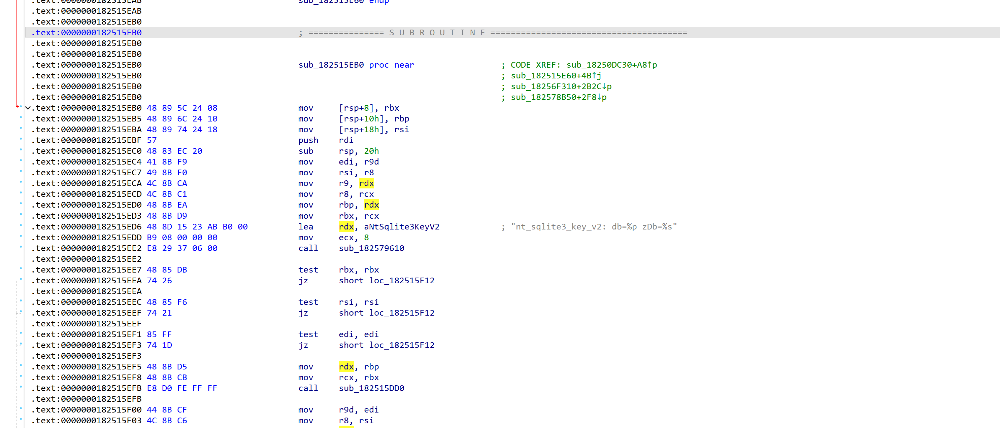

# Windows NTQQ 聊天消息数据库解密工具

在渗透取证过程中，目标的QQ上存在重要线索和重要信息，而QQ的聊天信息数据库是通过sqlite加密存储，因此需要实现对QQ聊天数据库的解密。

整个工具分为两部分，第一部分是从目标服务器中获取QQ聊天数据库并获取解密key，第二部分是对获取到的QQ聊天数据库进行解密以及聊天信息的解码。

**基本原理：**

1）NTQQ聊天数据库的解密：NTQQ 客户端项目分为前后端两个部分, 前端是使用 Web 技术开发的 UI 界面供用户交互，后端使用 nodejs addons 技术包装了一个库来处理客户端逻辑和与服务端通信，即wrapper.node。在wrapper.node模块中，存在函数nt_sqlite3_key_v2（登录时调用），这个函数的第三个参数为QQ聊天消息记录数据库的解密key。因此，只要定位到wrapper.node的基址以及nt_sqlite3_key_v2的偏移地址，对其进行hook，等待黑产登录时调用到nt_sqlite3_key_v2函数，即可拿到数据库解密密钥进行解密。

2）NTQQ聊天消息的解码：NTQQ的聊天数据库与PCQQ的聊天数据库的列名不同，聊天消息的存储方式也不同。在NTQQ中存储聊天消息时会对聊天消息进行protobuf序列化，因此如果想真正实现QQ聊天消息的读取就需要对存储的protobuf序列化数据进行反序列化。因为无法获取到实际的.proto文件，因此需要根据消息信息来推测还原.proto文件。

# Usage

* qqdump.exe: 在目标QQ运行时使用，qqdump首先会dump目标QQ聊天消息数据库，并退出目标QQ进程等待目标重新登录QQ并进行hook，获取到解密key后保存key和聊天数据库至QQ.zip
* qqdecrypt.exe: 下载QQ.zip至本地并解压，运行qqdecrypt并指定获取到的聊天数据库路径，工具会自动对聊天数据库进行解密以及对聊天消息进行解码。

# 技术细节

## nt_sqlite3_key_v2偏移地址查找

### 手动查找

使用 IDA Pro 打开wrapper.node，打开 Strings 视图，搜索 sqlite3_key_v2


跳转到主视图，再跳转到引用该字符串的位置：




获取此函数的偏移地址。

### IDAPython 脚本查找

因为上述手动查找的步骤可以编写IDAPython脚本自动完成，因此使用IDA Pro运行以下脚本即可自动化查找nt_sqlite3_key_v2的偏移地址：

```
import idautils
import idaapi
import idc

def main():
    # 获取程序的基址
    image_base = idaapi.get_imagebase()

    # 查找字符串 "nt_sqlite3_key_v2" 的地址
    ea = idc.find_text(0, idc.SEARCH_DOWN, 0, -1, "nt_sqlite3_key_v2")

    if ea != idc.BADADDR:
        # 打印找到的字符串地址
        print(f"Found 'nt_sqlite3_key_v2' at: 0x{ea:X}")

        # 查找该地址的交叉引用
        for xref in idautils.XrefsTo(ea):
            # 查找引用所在的函数
            func_addr = idc.get_func_attr(xref.frm, FUNCATTR_START)

            if func_addr:
                # 计算函数地址减去基址的偏移量
                offset = func_addr - image_base
                print(f"Function referencing 'nt_sqlite3_key_v2' at: 0x{func_addr:X}, offset: 0x{offset:X}")
            else:
                print(f"No function found for xref at: 0x{xref.frm:X}")
    else:
        print("String 'nt_sqlite3_key_v2' not found.")

if __name__ == "__main__":
    main()
```

## QQ Number偏移地址查找

登录QQ，使用CE attach到QQ.exe进程，设置Value Type为String，搜索QQ账号。图中红框中即为QQ账号相对于wrapper.node的偏移地址，选择其中一个即可：


## 数据库解密

### Sqlite3解密

首先，每个数据库文件头部有 1024 个字符的无用内容，去除这部分内容：

- Windows

  type nt_msg.db | more +1025 > nt_msg.clean.db

- UNIX

  cat nt_msg.db | tail -c +1025 > nt_msg.clean.db

通用配置选项：

```
PRAGMA key = 'pass';    -- pass 替换为之前得到的密码（32字节字符串）
PRAGMA cipher_page_size = 4096;
PRAGMA kdf_iter = 4000; -- 非默认值 256000
PRAGMA cipher_hmac_algorithm = HMAC_SHA1; -- 非默认值（见上文）
PRAGMA cipher_default_kdf_algorithm = PBKDF2_HMAC_SHA512;
PRAGMA cipher = 'aes-256-cbc';
```

设置完解密key、迭代次数以及算法后，通过以下语句可以导出解密后的数据库：

ATTACH DATABASE 'nt_msg.db' AS plaintext KEY ''; SELECT sqlcipher_export('plaintext'); DETACH DATABASE plaintext;

### bash命令解密（需安装好sqlcipher）

sqlcipher nt_msg.clean.db "pragma key = 'pass'; pragma kdf_iter = 4000; pragma cipher_hmac_algorithm = HMAC_SHA1;" .d | tail +2 | sqlite3 nt_msg.decrypt.db

### python代码解密

pysqlcipher3的编译与安装：https://www.zybuluo.com/caipiz/note/1396788

以下是一段解密示例代码：

```
def decryptDB(key, path):
    unencrypted_db = r"./decrypted/3988678329/nt_msg/nt_msg_decrypted.db"
    conn = None
    try:
        conn = sqlite.connect("cleaned/3988678329/nt_msg/nt_msg_cleaned.db")
        cursor = conn.cursor()
        cursor.execute(f"PRAGMA key = '{key}';")
        cursor.execute("PRAGMA cipher_page_size = 4096;")
        cursor.execute("PRAGMA kdf_iter = 4000;")
        cursor.execute("PRAGMA cipher_hmac_algorithm = HMAC_SHA1;")
        cursor.execute("PRAGMA cipher_default_kdf_algorithm = PBKDF2_HMAC_SHA512;")
        cursor.execute("PRAGMA cipher = 'aes-256-cbc';")
        cursor.execute("BEGIN;")
        cursor.execute(f"ATTACH DATABASE '{unencrypted_db}' AS plaintext KEY '';")
        cursor.execute("SELECT sqlcipher_export('plaintext');")
        cursor.execute("DETACH DATABASE plaintext;")
        conn.commit()
        cursor.close()
        conn.close()
    except Exception as e:
        print("失败")
    finally:
        if conn:
            conn.close()
```

## 获取NTQQ主进程句柄

NTQQ采用Electron技术作为QQ的全新技术架构，Electron 将使用两种类型的进程：主进程（main process）和渲染器进程（renderer process）。下图为NTQQ进程示意图：


因此打开NTQQ后，会发现存在多个QQ进程：


而wrapper.node模块是由主进程加载的，因此要想找到wrapper.node的基地址，就必须要获取到NTQQ的主进程句柄。在操作系统层面，Electron 的主进程实际上**启动**了渲染器进程，所以渲染器进程的 ppid（父进程 ID）会显示为主进程的进程 ID（PID）。因此通过以下办法获取NTQQ主进程的PID：

```
pids = []
    ppids = []
    for pid in psutil.pids():
        try:
            p = psutil.Process(pid)
            if p.name() == PROCESS_NAME:
                try:
                    pids.append(pid)
                    ppids.append(p.ppid())

                except psutil.NoSuchProcess:
                    print(f"QQ.exe with PID {pid} does not exist, might have been terminated already.")
                except psutil.AccessDenied:
                    print(f"Access denied when trying to terminate QQ.exe with PID {pid}.")
                except Exception as e:
                    print(f"An error occurred while terminating QQ.exe with PID {pid}: {e}")
        except psutil.NoSuchProcess:
            pass
    QQ_PIDs = set(pids) & set(ppids)
```

获取所有QQ.exe进程的pid以及ppid，接着取这两个数组中的相同元素即可。获取到主进程的PID后，就可以使用kernel32.dll的OpenProcess()函数获取到NTQQ主进程句柄。

## 反序列化NTQQ聊天消息

NTQQ聊天消息数据库中存储的聊天消息是一段protobuf序列化数据，聊天消息数据库消息表中的40800字段即为聊天消息，如下所示：


可以使用protobuf-inspector以及blackboxprotobuf分析此序列化数据，猜测其数据结构，可以构造出QQ_DB_Decrypt中的QQ_Message.proto，使用protoc编译该.proto文件得到python类库，即QQ_DB_Decrypt中的QQ_Message_pb2.py。接下来即可使用此类库进行QQ聊天消息的反序列化。

# Reference

https://github.com/QQBackup/qq-win-db-key/blob/master/%E6%95%99%E7%A8%8B%20-%20NTQQ%20(Windows).md

https://github.com/QQBackup/qq-win-db-key/issues/38#issuecomment-2294619828
